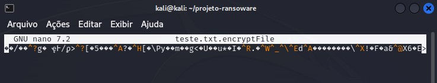
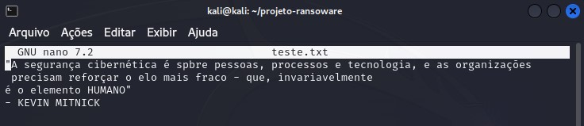

## Desafio Bootcamp Santander de Cibersegurança
Projeto de criptografar e descriptografar um arquivo txt com o python.

## Ferramentas
- Kali linux
- Python

## Resultado
### Arquivo teste.txt criptografado
**Comando**
```
$ python encrypter.py
```


### Arquivo descriptografado
**Comando**
```
$ python descrypter.py
```


Observação: 
O AES aceita chaves de tamanho fixo: 128 bits (16 bytes), 192 bits (24 bytes) ou 256 bits (32 bytes).

